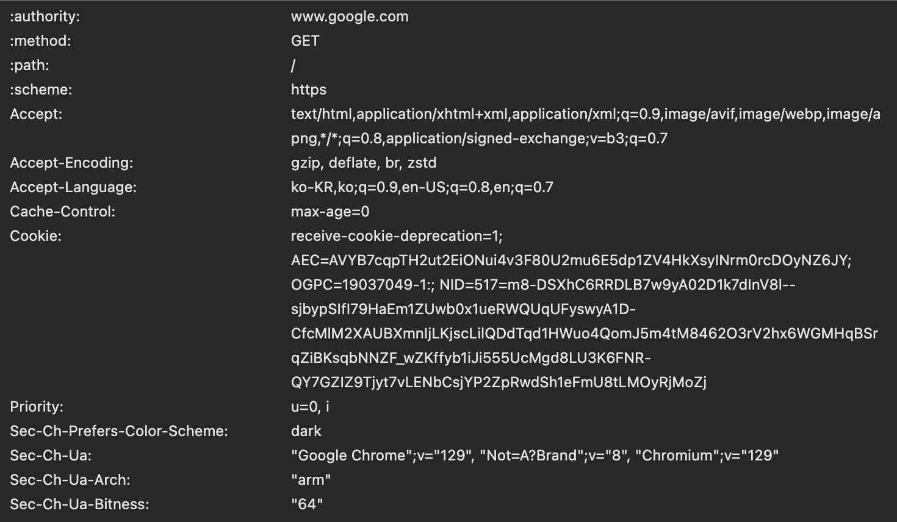
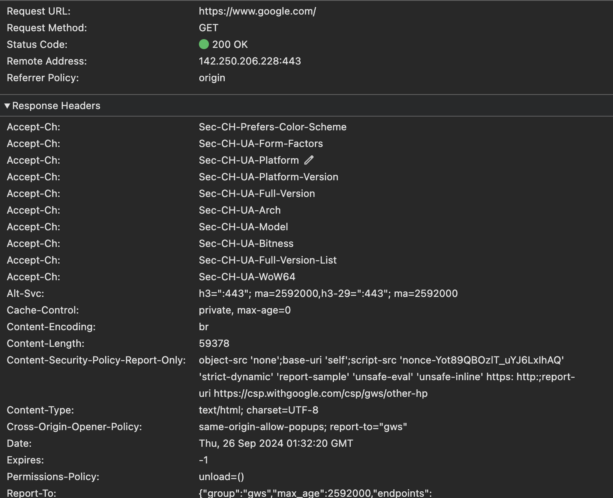
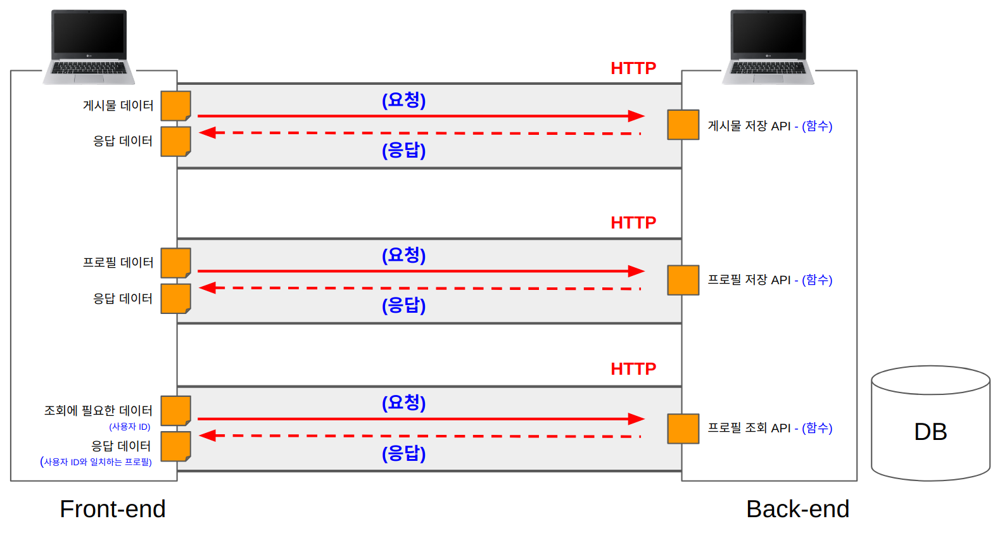

# [WEEK 01] 온보딩 (기간 : 9/23 ~ 9/26)

## COW SPRING 4기 PRE-ONBOARDING 학습 과제

본격적으로 Spring 학습에 들어가기 전에 여러분은 객체지향 코드에 대해 학습하고 이해하는 시간을 가지실겁니다!

객체지향 코드를 짜기 위해서는 우리가 사용할 언어인 JAVA에 대해 이해하고 있어야합니다.
.
이 온보딩 과제는 이번 COW Server 파트에 함께 하시는 7분의 개개인의 역량이 다르기 때문에 가장 최소한으로 알고 계셔야 할 내용을 중심으로 선정해봤어요!

많은 양의 정리를 요구하지 않는 과제이니 이해하신 내용을 토대로 간단하게 정리해주시면 됩니다. (1, 2, 3기의 학습자료가 github에 나와있으니 참고하셔도 좋아요☺️)

개인적으로, 분명 학습했던걸 다 기억하실 수 없으실거예요! 저도 마찬가지이고요.. 공부했던 것을 잘 정리해두는 습관을 가지는 것은 분명 큰 도움으로 돌아올 것이라 생각합니다. 그런 의미로 다들 파이팅해봐요!

---
> 아래의 필수 질문은 모든 분들이 정리하고 학습하셔야하는 내용입니다. 선택 질문은 원하시는 분들만 하시면 되지만 분명 학습하시면 큰 도움이 될 것들을 추려봤습니다!

# 필수

## www.google.com을 치면 일어나는일

---
### Keywords : DNS, TCP/IP프로토콜, WS, WAS

---
### 1.  브라우저 주소창에 www.google.com을 입력하면 브라우저가 해당 URL의 IP 주소를 찾기 위해 캐시에서 DNS 기록을 확인한다.
> DNS란?
> 
> DNS(Domain Name System)는 인터넷의 전화번호부라고 할 수 있다. DNS는 웹사이트의 도메인 이름을 고유한 IP 주소와 연결해 주는 시스템이다. 예를 들어, 사용자가 웹 브라우저에 google.com을 입력해서 해당 웹 사이트에 접근하는건 쉽지만, 
> 192.xxx.xxx.xxx와 같은 IP 주소를 기억하고 입력하는 것은 어렵다.
> DNS는 사람이 이해하기 쉬운 도메인 이름을 컴퓨터가 통신할 수 있는 IP 주소로 변환해 주어, 웹사이트에 쉽게 접근할 수 있도록 돕는다.
> 
> 캐시를 찾는 이유: 
> 
> 브라우저는 내가 이전에 방문한 웹 사이트의 DNS 기록을 일정 기간 동안 저장하고 있으므로, 캐시를 확인해서 DNS 기록을 찾는다.

### 2. 만약 요청한 URL(www.goolge.com)이 캐시에 없다면, ISP의 DNS 서버가 DNS 쿼리로 www.google.com을 호스팅하는 서버의 IP 주소를 찾는다.

> DNS 쿼리란?
>
> DNS Query(쿼리)는 사용자가 도메인 이름을 입력하고 IP 주소를 얻기 위해 DNS 서버에 보내는 요청을 말한다.
DNS Query DNS 서버에 보내지고, DNS 서버는 이를 처리하고 응답을 반환한다. DNS Query의 결과는 DNS Resolver에게 반환되는데
이를 통해 DNS Resolver는 사용자에게 도메인 이름에 대한 IP 주소를 반환하거나. 이를 찾을 수 없을 경우 에러를 반환한다.

### 3. 브라우저가 해당 서버와 TCP 연결을 시작한다.

> 브라우저가 올바른 IP 주소를 수신하면 IP 주소와 일치하는 서버와 연결해 정보를 전송한다. 브라우저는 인터넷 프로토콜(IP, Internet Protocol)을 사용하여 이러한 연결을 구축한다.
> 사용할 수 있는 여러가지 Protocol이 있지만, 일반적으로 HTTP 요청에서는 TCP(Transmission Control Protocol)라는 전송 제어 프로토콜을 사용한다.

* Internet Protocol이란? 
> 
> Internet Protocol(IP)은 데이터 패킷이 네트워크를 통해 이동하고 올바른 대상에 도착할 수 있도록 데이터 패킷을 라우팅하고 주소를 지정하기 위한 프로토콜 또는 규칙의 집합이다.
> 
> 쉽게 말해, 송신자가 보내고 싶은 데이터를 지정한 IP(수신자)에게 전달하는 역할이라고 할 수 있다. 이때, 전송하고자 하는 데이터를 하나의 패킷(Packet)이라는 통신 단위로 묶어 전달한다.

* TCP란?
> 
> TCP는 서버와 클라이언트 간에 데이터를 신뢰성 있게 전달하기 위해 만들어진 프로토콜(통신 규칙)이다. 또한, 데이터를 전송하기 전에 데이터 전송을 위한 연결을 만드는 연결지향 프로토콜이라고 할 수 있다.
>> TCP/IP
>>
>> TCP/IP는 전송계층의 TCP와 네트워크 계층의 IP프로토콜을 합친 프로토콜 스위트(모음)으로, TCP는 데이터의 정확성 확인, IP는 패킷을 목적지까지 전송하는 역할을 한다.
인터넷 접속을 위한 기본 프로토콜이다.
또한, TCP/IP에선 OSI 7 Layer을 대체하는 TCP/IP 4 Layer가 있다.

### 4. 브라우저가 웹 서버에 HTTP 요청을 보낸다.

> TCP 연결이 설정되면 데이터 전송이 시작된다. 브라우저는 www.google.com 웹 페이지를 요청하는 GET 요청을 보낸다.

www.google.com 의 GET 요청은 다음과 같다.
> 
>* 요청하는 서버의 도메인 이름: www.google.com
>* 사용된 HTTP 메서드: GET
>* 요청된 리소스 경로: /
>* 요청 스킴: HTTPS
>* 수신 가능한 데이터 형식(Accept):  text/html, application/xhtml+xml, application/xml, image/avif, image/webp, image/png, / (기타 형식도 가능)
>* ...

### 5. 서버가 요청을 처리하고 응답(response)을 보낸다.
> 서버 응답에는 요청한 웹 페이지와 함께 상태 코드(status code), 압축 유형(Content-Encoding), 페이지 캐싱 방법(Cache-Control) 등이 포함된다.

다음은 서버의 HTTP 응답 예시이다.
> 
>>위의 응답을 보면 Status Code 헤더에 상태 코드가 표시된다. 이것이 우리에게 response의 상태를 알려주기 때문에 매우 중요하다. 숫자 코드를 사용하여 HTTP 응답 결과를 다섯가지 상태로 나눈다.
>>
>>> * 1xx(In)1xx (Information Response): 정보 메시지만을 나타낸다. 서버가 요청을 받았으며 서버에 연결된 클라이언트는 계속해서 작업을 하라는 뜻.
>>> * 2xx (Successful Response): 서버와의 요청이 성공함을 나타냄
>>> * 3xx (Redirection Message) : 요청 완료를 위해 추가 작업 조치가 필요함을 의미함. 위 사진의 301(Moved Permantly)는 요청한 리소스의 URI가 변경 되었음을 뜻한다.
>>> * 4xx (Client Error Response) : 클라이언트의 Request에 에러가 있음을 의미함.
>>> * 5xx (Server Error) : 서버 측의 오류로 request를 수행할 수 없음.
>>> 
>>> 
>>>  따라서 오류가 발생한 경우 HTTP 응답을 확인하여 수신한 상태 코드의 유형을 확인할 수 있다.
> ##### 또한 다음과 같은 내용을 포함하고 있다.
>* Accept-CH: 클라이언트가 서버에게 보낼 수 있는 정보에 대한 설정 목록(Ex: 브라우저의 색상 테마, 플랫폼 정보, CPU 아키텍처 등)
>* Alt-Svc: 대체 서비스 정보로 서버가 클라이언트에게 제안하는 HTTP/3 같은 다른 통신 프로토콜 사용을 권장하고 있음
>* Cache-Control: 응답에 대한 캐시 제어 방식(여기서는 private, max-age=0으로 캐시 사용 안함)
>* Content-Enconding: 서버가 응답을 압축할 때 사용하는 방식(여기서는 br, Brotoil 압축 사용)
>* Content-Length: 응답 본문의 크기(여기서는 59378)
>* ...

### 6. 브라우저가 HTML 컨텐츠를 보여준다.
> 브라우저는 응답받은 HTML을 화면에 단계별로 표시한다. 
> 첫째로, HTML 골격을 렌더링한다. 그런다음 HTML 태그를 확인하고 이미지, CSS 스타일시트, JavaScript 파일 등과 같은 웹 페이지의 추가 요소에 대한 GET 요청을 보낸다.
> 그리고 정적 파일(Static File)은 브라우저에서 캐싱되므로 다음에 페이지를 방문할 때 다시 가져올 필요가 없다. 그리고 마지막으로, www.google.com 페이지가 브라우저에 나타난다.

## API, HTTP통신

---
## HTTP 통신
HTTP는 두 컴퓨터간에 텍스트 데이터를 주고 받는 길이다. HTTP 라는 길로 요청(request)과 응답(response) 두 가지를 서로 주고 받을 수 있다.

* ### HTTP 요청
웹 브라우저에서 홈페이지(front-end)가 실행중이라면, 작성한 게시물(데이터)을 HTTP를 통해 서버(back-end)로 보내고
서버는 이 데이터를 데이터베이스에 저장 해달라고 요청한다.

> #### 그럼 데이터베이스에 바로 요청하면 안되는걸까?
> 
> 보안 및 데이터 정제 등의 이윺로 Back-end 에서 검증 과정을 거쳐야 하기 때문에, 아무나 함부로 데이터 베이스에 요청할 수 없다.

* ### HTTP 응답(Res)
요청을 받은 서버는 성공, 실패 등의 처리 결과를 응답한다. 이때 서버에서는 응답할 때 100-599 사이 숫자의 상태 코드도 함께 보내준다.
자주 몰 수 있는 상태코드는 성공(200), front-end 에러(400), back-end 에러(500)등이 있다.

## API
API란 HTTP 요청을 서버에 보냈을때 실행되는 back-end 기능이다. 즉, API는 back-end 개발자가 만든 함수이다. 요청할때 보내는 데이터는
API 함수로 들어가는 인자이고, 응답을 받게되는 데이터가 API 함수의 return 데이터이다.
> 
> API에 대한 개념 설명

## API의 종류(Rest API VS GraphQI API)

### 1. 함수 이름의 차이
> Rest API는 API이름이 홈페이지 주소처럼 생겼다.
> 
> GraphQI API는 API 이름이 일반적이 함수와 같다.

### 2. 응답 결과물의 차이
> Rest API는 응답 결과로 back-end 개발자가 만든 함수에서 보내주는 모든 데이터를 받아야 한다.
> 
> GraphQl API는 back-end 개발자가 만든 함수에서 필요한 데이터만 골라 받을 수 있다.
> * GraphQl API는 필요한 데이터만 골라 받을 수 있는 장점이 있어서 효율적인 통신을 할 수 있다.

### 3. 라이브러리
> Rest API는 axios
> 
> GraphQI API는 apollo-client

## 백엔드가 하는 일

---

## 객체지향 특징 및 장점

---

## 코드 컨벤션이란

---

## MVC 패턴

---

## 느낀점 & 궁금한점

---
IP에 대한 점..

WS / WAS dp 에 대한 점..

## 참고

- [브라우저에 url을 입력하면 어떤 일이 벌어질까?](https://velog.io/@khy226/브라우저에-url을-입력하면-어떤일이-벌어질까)
- [브라우저에 www.google.com을 치면 일어나는 일](https://velog.io/@o1011/브라우저에-www.google.com-을-치면-일어나는일)
- [DNS란? (AWS Route 53)](https://aws.amazon.com/ko/route53/what-is-dns/)
- [DNS(Domain Name System)란?](https://velog.io/@zinukk/9kpyzbdt)
- [IP(Internet Protocol)](https://dreamcoding.tistory.com/33)
- [TCP란?](https://velog.io/@younghyun/TCP란)
- [HTTP 통신과 API(Rest API, GraphQI API)](https://velog.io/@larmong/HTTP-통신)
- [HTTP 통신과 API](https://velog.io/@sehee-xx/HTTP-통신과-API)