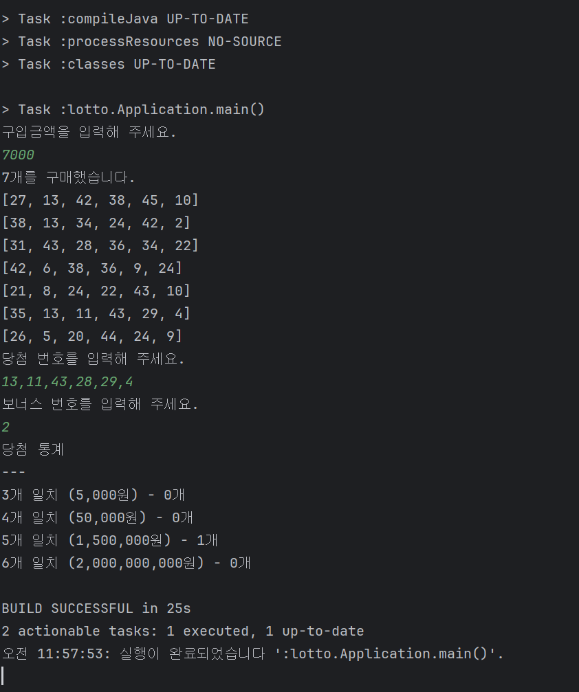

# 2주차 학습 내용

객체지향 코드를 짜기가 어려웠습니다. 전공 수업에서는 교수님의 코드를 보고 따라하며 이해했습니다. 그러나,
막상 직접 처음부터 짜려니 여러 문제가 생겼습니다.

기능 구현에 있어서는 생각보다 어려움을 겪지 않았으나,
예외 처리, 클래스 분리, 관심사 분리 등에서 어려움을 겪었습니다. 
전공 수업에서 실습했던 것이지만, 실제로 적용하려 하니 다양한 문제가 생겼습니다.
테스트 코드는 처음 마주했기도 하고, 프로그램을 완성하지 못해 작성하지 못했습니다.

이번 과제로 제가 어떤 부분이 부족한지 알았고, 공부할 것을 알게 되었습니다. 
또한 MVC 패턴을 전공 수업에서 배웠을 때는 정확히 이해가 되지 않았는데,
직접 MVC 패턴을 적용해보니(완벽하게 적용하지는 못했습니다) 각각의 구성요소의 역할을 정확히 알게 되었습니다.
다음 과제부터는 더 노력하여 완성해보고 싶습니다.

감사합니다. 

PR 주소: https://github.com/COW-edu/practice-oop-lotto/pull/32

